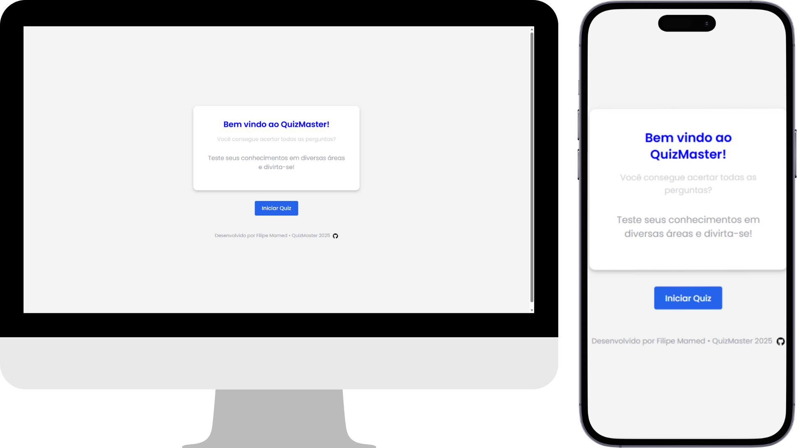
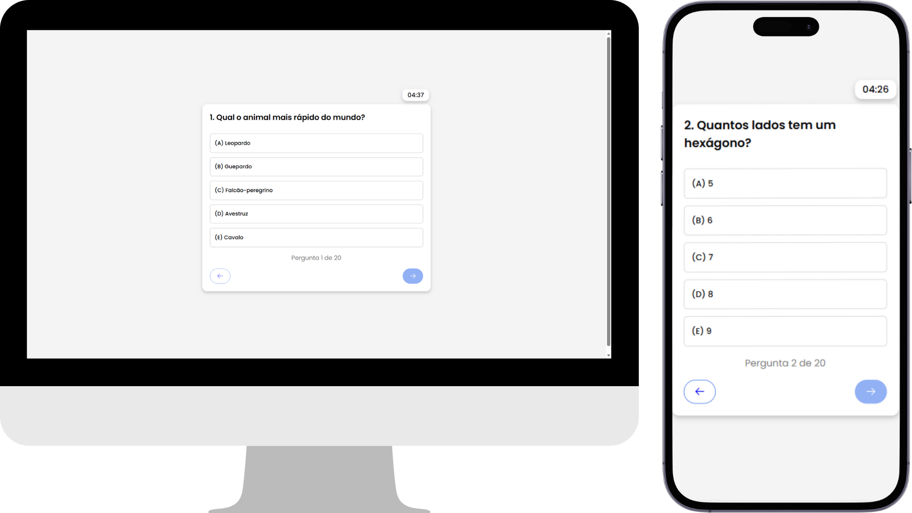
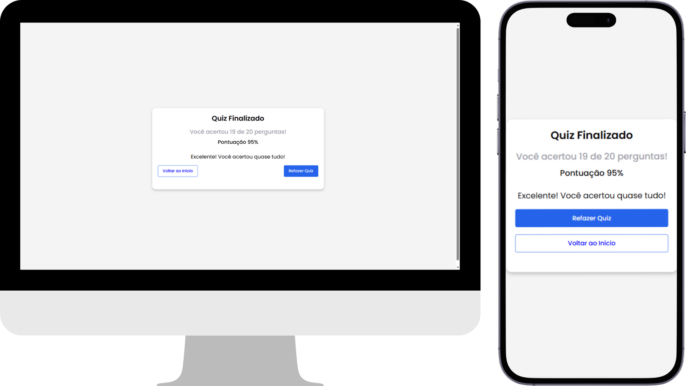

# Quiz Master ❓


Uma aplicação de perguntas e respostas interativas, onde o usuário responde um quiz em tempo real, visualiza seu desempenho e recebe um resultado final.

---

## 🛠 Tecnologias Utilizadas

### **Frontend**

- 

-  &nbsp;&nbsp;|&nbsp;&nbsp; 

- 

- 

- 

- React-Icons

### **Backend**

- 

- 

- 

- Cors

- Chalk

- dotenv

## 📸 Demostração do Projeto

### **Página Home**



---

### **Página Quiz**



---

### **Página Resultado**



## 🌐 Website

Acesse o projeto online: **[QuizMaster](#)**
_(adicione seu link aqui quando publicar)_

---

## 🚀 Como executar o projeto

### 🔧 Pré-requisitos

- Node.js
- npm ou yarn

---

### 📦 Instalando dependências

1. Clone o repositório:

```bash
https://github.com/Filipe-Mamed/quiz-master.git
```

2.  Backend:

```bash
# Navegue até a pasta do 'backend'
cd backend

# Instale as dependências do backend
npm install
```

3. Frontend:

```bash
# Navegue até a pasta do frontend
cd frontend

# Instale as dependências do frontend
npm install
```

## 📂 Variáveis de ambiente

> ⚠️ **Observação:**
> Para ver quais variáveis de ambiente são necessárias, abra o arquivo `.env.example` na pasta **frontend** ou **backend**.

## 📄 Licença

Este projeto está licenciado sob a Licença MIT. Veja o arquivo [LICENSE](LICENSE) para mais detalhes.
